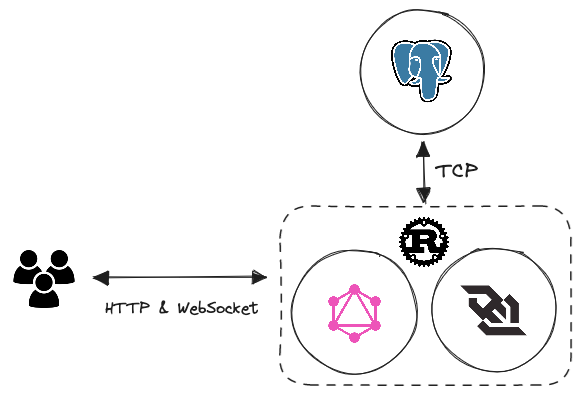

<div align="center">
  <span style="font-size: 64px;">🏖️</span>
  <h1 align="center">playa</h1>
  <p align="center">
    Decentralized Social Platform powered by Rust and Whizzes Contributors
  </p>
</div>

<div align="center">

  [](https://discord.gg/yde6mcgs2C)
  
  
  

</div>

## Development

### Requirements

- [Rust](https://rustup.rs)
- [Docker](https://www.docker.com)
- [Justfile](https://github.com/casey/just) (**Recommended**)

### Getting Started

```bash
# install just command runner
cargo install just

# clone this repository
git clone https://github.com/whizzes/playa.git


# step into repository directory
cd ./playa

# open a termital window and spin up Docker Containers
just dev

# create a new terminal window and run database migrations
just prepare

# execute the server (next time you just run this command)
cargo run serve
```

> Note: As of today migrations runs when bootstrapping the server automatically

## Architecture

<div align="center">
  
</div>

## Contributions

All contributions to this project are welcome. Feel free to open a PR or issue

## License

Licensed under the MIT License
