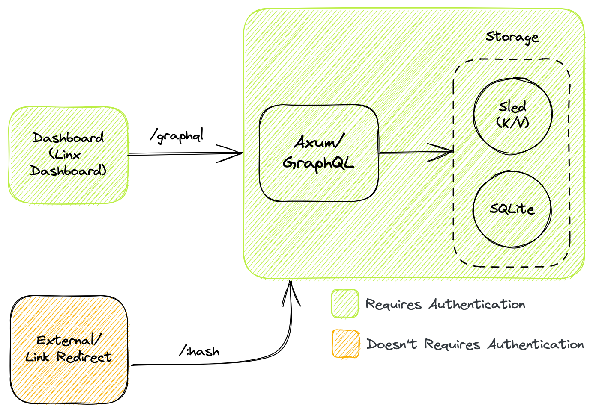

<div>
  <h1 align="center">quicklink</h1>
  <p align="center">Headless URL Shortener</p>
</div>

<div align="center">

  [](https://discord.gg/yde6mcgs2C)
  
  
  

</div>

## Development

### Requirements

- [Rust](https://rustup.rs)
- [Justfile](https://github.com/casey/just) (**Recommended**)

### Getting Started

```bash
# install just command runner
cargo install just

# clone this repository
git clone https://github.com/whizzes/quicklink.git

# step into repository directory
cd ./quicklink

# prepare project (depends on unix shell)
just prepare

# execute the server (next time you just run this command)
just serve
```

> Note: As of today migrations runs when bootstrapping the server automatically

## GUI

Even though Quicklink is designed to be a Headless URL Shortener, you can
use the Dashboard solution for a enhanced user experience.

Visit the source code on [quicklink-dashboard][1]

## Architecture

<div align="center">
  
</div>

## Contributions

All contributions to this project are welcome. Feel free to open a PR or issue

## License

Licensed under the MIT License

[1]: https://github.com/whizzes/quicklink-dashboard
